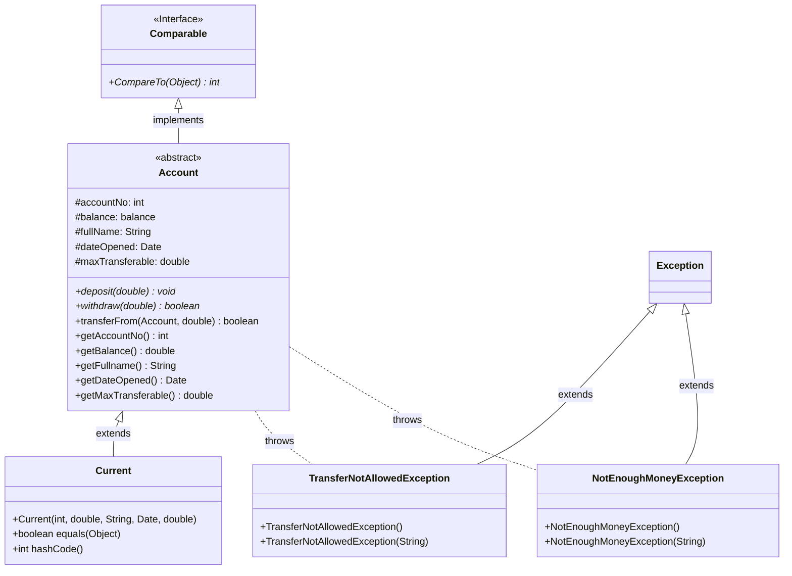
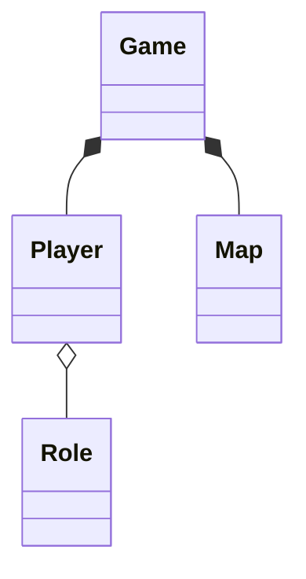
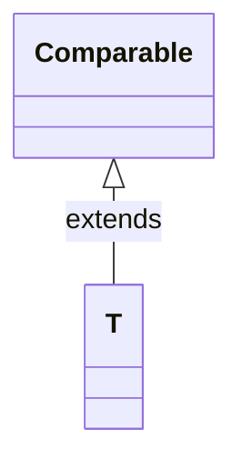
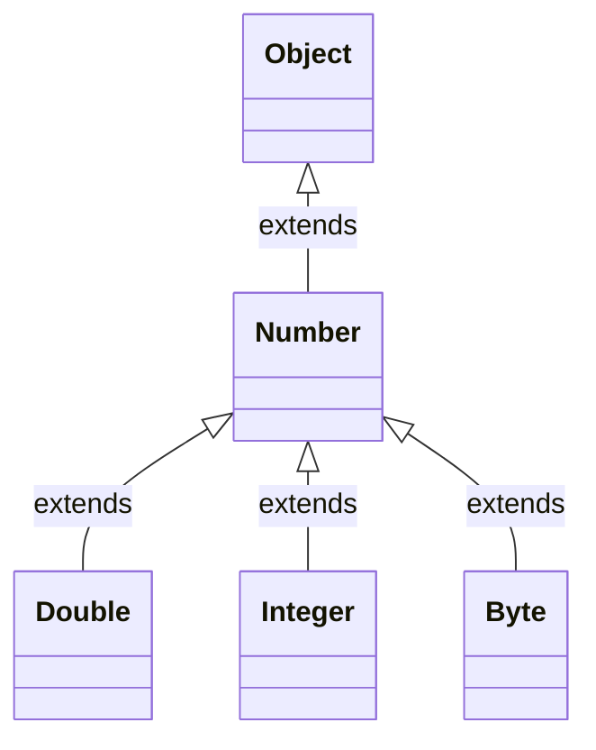
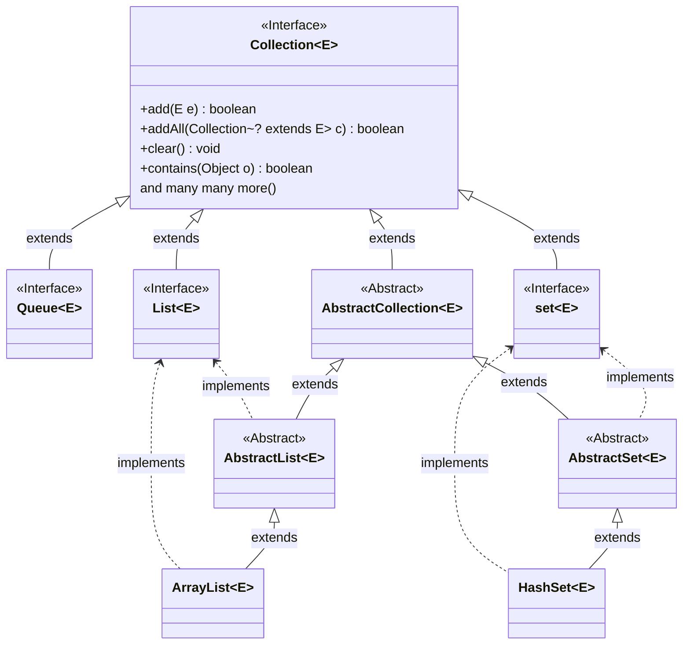
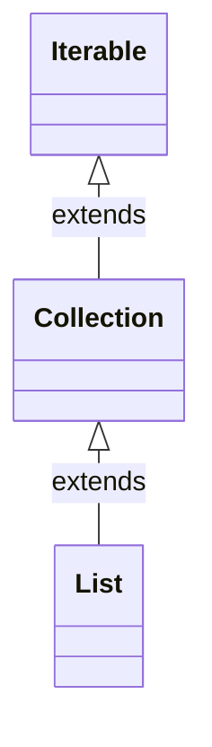
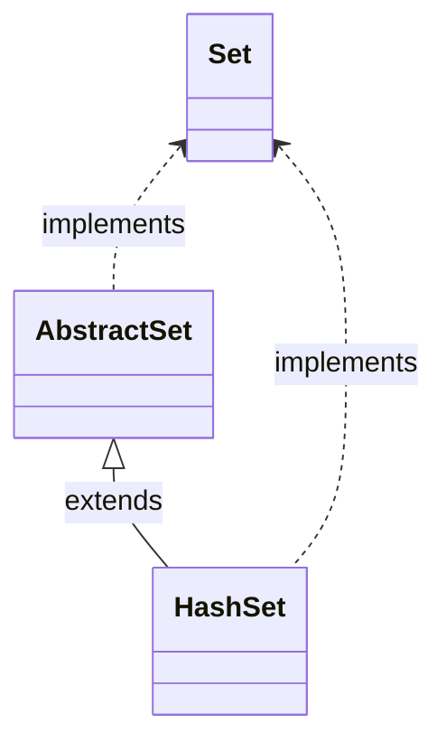

The ready(-to-)wear collection is ready to wear for anyone.

This file has quick references and explanations.

For notes taken from lecture,
try out our [autumn-winter 2022 haute couture collection](cs%202030%20notes.md).

# Table of Contents

- [Mark Breakdown](#mark-breakdown)
- [Java Basics Review](#java-basics-review)
  - [Packages](#packages)
  - [Memory Model](#memory-model)
    - [Primitives](#primitives)
    - [Non-Primitives/References](#non-primitivesreferences)
      - [References, Object Reachability, and Garbage Collection](#references-object-reachability-and-garbage-collection)
  - [Function Calls - Memory and Pass by Value vs Reference](#function-calls---memory-and-pass-by-value-vs-reference)
- [JavaDoc](#javadoc)
- [Testing, Unit Testing, & JUnit](#testing-unit-testing--junit)
- [Design by Contract](#design-by-contract)
- [Recursion](#recursion)
- [Classes](#classes)
  - [Constructors](#constructors)
    - [Overloaded Constructors](#overloaded-constructors)
    - [Constructor Chaining](#constructor-chaining)
    - [Clone/Copy Constructor](#clonecopy-constructor)
- [Generics](#generics)
- [Encapsulation](#encapsulation)
  - [Access Modifiers](#access-modifiers)
  - [Mutators & Accessors - Setters & Getters](#mutators--accessors---setters--getters)
- [Object Oriented Programming - OOP](#object-oriented-programming---oop)
- [UML - Unified Modelling Language](#uml---unified-modelling-language)
- [-](#-)
- [Inheritance](#inheritance)
  - [Optional Methods](#optional-methods)
- [-](#-)
- [Generics](#generics)
  - [Why Make Generics?](#why-make-generics)
  - [Generic Creation & Usage](#generic-creation--usage)
    - [Generic Classes and Instance Variables](#generic-classes-and-instance-variables)
    - [Generic methods](#generic-methods)
    - [Generic Methods, Autoboxing, and Wrapper Classes](#generic-methods-autoboxing-and-wrapper-classes)
  - [Generic Inheritance](#generic-inheritance)
  - [Arrays of Generics](#arrays-of-generics)
  - [Bounded Type Parameters](#bounded-type-parameters)
    - [Wildcards](#wildcards)
      - [Upper Bound Wildcards](#upper-bound-wildcards)
      - [Lower Bound Wildcards](#lower-bound-wildcards)
    - [Unbounded Wildcards](#unbounded-wildcards)
      - [How To Use Wildcards](#how-to-use-wildcards)
- [Abstract Data Types (ADTs) - Collections/Data Structures](#abstract-data-types-adts---collectionsdata-structures)
  - [Why Make ADTs?](#why-make-adts)
  - [Java ADTs](#java-adts)
    - [ADT Example: Stack](#adt-example-stack)
    - [Java's Built-in ADTs - Collections, Lists, and Sets](#javas-built-in-adts---collections-lists-and-sets)
      - [List](#list)
      - [Set](#set)

# Mark Breakdown

|                               | weight | comment                                          |
|-------------------------------|--------|--------------------------------------------------|
| in-class activities (iCocker) | 10%    | opens during lecture, usually open till midnight |
| Labs                          | 10%    | 10 labs, 1%/each, take home, 1 week              |
| Programming Exams             | 40%    | 2 exaams, 20%/each, take home, 1 week            |
| Term Test                     | 20%    | in-person, written, closed-book                  |
| Final Exam                    | ^      | ^                                                |

50% rule:
Earn at least a cumulative 50% across both written exams.

Your term test mark gets dropped if you're final exam mark is better.

# Java Basics Review

```java
//myProgram.java
public class myProgram{
  variable_type variable_name;
  
  public static void main(String[] args){
    //code
  } //end of main
} // end of class
```
a basic java file will look like this

## Packages

We use packages to group classes together.

Inside of a single package we can't have different classes with the same name so if ever we need to do something like that we place it in another package.

Packages can contain other packages that we refer to as subpackages.

We access these using the dot, `.`, operator:
- `package_name.sub_package_name`
- `Java.lang`
- `Java.io`

## Memory Model

Data Types & Addresses

| name    | size(bits) | size(bytes) | value range                                          | operators            |
|---------|------------|-------------|------------------------------------------------------|----------------------|
| byte    | 8          | 1           | (-128)-(127)                                         | + - * /              |
| short   | 16         | 2           | (-32,768)-(32,767)                                   | ^                    |
| int     | 32         | 4           | (-2^31)-( (2^31) -1)                                 | ^                    |
| long    | 64         | 8           | (-2^63)-( (2^63) -1)                                 | ^                    |
| float   | 32         | 4           | floats are approximations and can only be so precise | ^                    |
| double  | 64         | 8           | not going into this                                  | ^                    |
| boolean | 1          |             | true or false (0 or 1)                               | && (the two lines) ! |
| char    | 16         | 2           | unicode 0-65535                                      | < <= > >= == !=      |

1 byte = 8 bits = 1 address

If a data type is too big to fit in 1 address then it takes up however many addresses it needs.
If a data type is too small to fill out a whole address it still occupies that whole address.

When a variable of a certain data type is defined,
the correct amount of spaces are reserved to accommodate the data.

There are two main sections to the memory that we're concerned about in this course,
the garbage collectible heap and the main stack.
The garbage collectible heap is an area in the method that java looks over periodically and cleans up when it finds data that isn't being used/referenced by the main stack,
this process is known as garbage collection.
[non-primitive/reference types and their interaction with memory are covered more in their own section.](#non-primitivesreferences)

### Primitives

Code:

```java
int height = 165;
double weight = 58.5;
char initial = 'D';
boolean found = true;
```

| var name | memory address | memory spaces | size(bytes) |
|----------|----------------|---------------|-------------|
| height   | 100            | 165           | 4           |
| weight   | 104            | 58            | 8           |
| initial  | 112            | 'D'           | 2           |
| found    | 114            | true          | 1           |

### Non-Primitives/References

With non-primitives/references we're actually pointing to another object in the memory elsewhere in the garbage collectible heap.

---

arrays are a simple example of non-primitive/reference types.

```java
int [] height = {165, 170};
double [] weight = {58.5, 70.4};
```

| var name | memory address | memory spaces | memory area |
|----------|----------------|---------------|-------------|
| height   | 100            | 200a          | Stack       |
| weight   | *              | *208a         |             |
| ...      | ...            | ...           | ...         |
|          | 200            |               | GCH         |

*In the case of non-primitive reference types like arrays
there's no universal amount of reserved space for storing the addresses.
In lieu of that certainty we just use notation to denote that these are separate objects in the memory, which objects belong to who, and that everything that is a reference type is in the garbage collectible heap.

For the variables `height[]` and `weight[]` we store the address where the actual data is stored as opposed to the actual data.
This is mainly because the size of the actual data may change and having that in the main stack is a headache.
The address that we store points to somewhere within the GCH.

This is also how objects of classes that we instantiate are stored.

Reference types have zero or more states that are represented by their instance variables aka fields or attributes.

--- 

Objects are also reference types.

Class code:

```java
public class Student {
  char initial;
  int studentId;
  int enrolmentYear;
  
  public Student (Student st) {
    this.initial = st.initial;
    this.studentId = st.studentId;
    this.enrolmentYear = st.enrolmentYear;
  }
}
```
Our code using the `Student` class:
```java
Student alice = new Student('A', 1256, 2016);
Student rose = new Student(alice);
```

memory diagram:

| address | stored |               | memory area |
|---------|--------|---------------|-------------|
| 100     | 2000a  | alice         | Stack       |
|         | 3000a  | rose          |             |
| ...     | ...    | ...           |             |
| 2000    | A      | initial       | GCH         |
|         | 1256   | studnetId     |             |
|         | 2016   | enrolmentYear |             |
| ...     | ...    | ...           |             |
| 3000    | R      | intial        | GCH         |
|         | 1256   | studentId     |             |
|         | 2016   | enrolmentYear |             |

Similarly to arrays,
the main stack merely holds a reference to an address in the GCH where the data is actually stored.

We can even have variables that point towards the same address
```java
// rose is an object of Student
rose.initial = 'R';
rose.studentId = 1000;
rose.enrolmentYear = 2020;
Student julia = rose;
```

memory diagram:

| address | stored |               |
|---------|--------|---------------|
| 100     | 2000a  | rose          |
|         | 2000a  | julia         |
| ...     | ...    | ...           |
| 2000    | A      | initial       |
|         | 1256   | studnetId     |
|         | 2016   | enrolmentYear |

#### References, Object Reachability, and Garbage Collection

There are 2 different kinds of references:
- active
  - points to an object in the memory
- null
  - doesn't point to anything

There are 2 different kinds of objects:
- reachable
  - is pointed to by at least 1 active reference
  - the components in memory can be accesses/reached
- unreachable
  - isn't pointed to by any references
  - the components in memory cannot be accesses/reached

The garbage collection system finds these unreachable objects and declares them as free space to be overwritten by the program.

---

```java
Student john = new Student(); //1
Student jane = new Student(); //2
john = jane;                  //3
jane = null;                  //4
```

Line 1:

| address | stored                   |               |
|---------|--------------------------|---------------|
| 100     | 2000a                    | object `john` |
| ...     | ...                      | ...           |
| 2000    | \<all of `john`'s stuff> |               |

Line 2:

| address | stored                   |               |
|---------|--------------------------|---------------|
| 100     | 2000a                    | object `john` |
|         | 3000a                    | object `jane` |
| ...     | ...                      | ...           |
| 2000    | \<all of `john`'s stuff> |               |
| ...     | ...                      | ...           |
| 3000    | \<all of `jane`'s stuff> |               |

Line3:

| address | stored                   |               |
|---------|--------------------------|---------------|
| 100     | 3000a                    | object `john` |
|         | 3000a                    | object `jane` |
| ...     | ...                      | ...           |
| 2000    | \<all of `john`'s stuff> |               |
| ...     | ...                      | ...           |
| 3000    | \<all of `jane`'s stuff> |               |

Line4:

| address | stored                   |               |
|---------|--------------------------|---------------|
| 100     | 3000a                    | object `john` |
|         | null                     | object `jane` |
| ...     | ...                      | ...           |
| 2000    | \<all of `john`'s stuff> |               |
| ...     | ...                      | ...           |
| 3000    | \<all of `jane`'s stuff> |               |

The data stored in `2000` which was `john`'s old data is now unreachable so it's garbage collectable.

## Function Calls - Memory and Pass by Value vs Reference
Whenever a function is called in Java,
a new space in the memory is created on the stack.
We call this the function stack.

When we pass an argument into a function different things will happen depending on whether or not the data type is primitive or non-primitive.

If the data type is primitive then we call that a "pass by value".
The actual value of the argument is copied to the functions stack and we work on that data within the function.
The primitive exists on the main stack as well as the function stack.
However, if we make modifications to the primitive on the function stack it doesn't alter it on the main stack as it is merely a copy.

If the data type is a non-primitive/reference type then we call that a "pass by reference".
Java will copy the reference to the object we want to pass on that we have saved on the main stack into a memory address inside of the function stack.
That object exists in GCH however there are two variables that point to its address during the function call,
the variable on the main stack and the variable inside of the function stack.

# JavaDoc

JavaDoc allows us to write comments above our code to keep track of how code functions,
show others how the code functions,
and export to an html api that makes all the information much more easy to parse through.

To use JavaDoc for a method, function, or class you create a blook comment on the line above yourmethod with the first line being `/**`

Here are the most common/useful pieces of JavaDoc:
- `@author` and `@version` state the obvious about your code
- `@param` describes an input to your method
- `@return` describes the output of your method
- JavaDoc makes use of some html syntax
  - `<p></p>` makes a paragraph
  - `<code> </code>` will put a different typeface upon export to show that you are referring to a piece of code.

Most Java focused IDEs have an option to export JavaDoc to an html api as well as generate block comments.

General use IDEs, like visual studio code, can do the same with the help of plugins.


```java
/**
 * This method exists to help me demonstrate JavaDoc to you
 *
 * @author Me
 * @version 1.0.0
 * @param arg1 is an <code>int</code> that represents my favourite number
 * @param arg2 is a <code>String</code> that represents my favourite word
 * @param arg3 is a <code>double</code> that represents my bank balance
 * @return returns the result of this method.
 */
public demonstrationMethod(int arg1, String arg2, double arg3) {
  ...
  return result;
}
```

# Testing, Unit Testing, & JUnit

In order to ensure that code works we test it beforehand by feeding feeding inputs and comparing the actual outputs versus expected outputs.

Unit testing is testing the smallest units of our code that we can test,
the methods.

As opposed to testing in the `main()` function we test using a unit testing framework like JUnit.

Unit testing is used to catch the logical and runtime errors.

# Design by Contract

Design by contract is the idea that there is a contract between the coder/implementer(you) and the user/client.

The contract states that the code will only work if:
1. the client passes an input that the implementer expects
   - pre-condition
2. the output is what's expected by the client
   - post-condition

Invariants are another part of design by contract.
An invariant is a statement that is true during a certain point in a program's execution.
Generally an invariant is a certain property that is assumed to be true on the entry of a method and guaranteed to be true on the exit of the method.
Invariants are often used to test for program correctness.

If the pre-conditions isn't met by the client then the contract has been violated.
In these cases we can throw an exception and change the flow of the program to do any or all of the following:
- perform different/additional logic
- generate a message
- stop the program

# Recursion

A recursive function is a function that calls itself.
When this happens it's exactly like a normal function call;
references are passed in,
values are passed in,
and a new stack frame is created.

Stack overflow is when too many stacks are created and we run out of memory for the program.

A recursive function has different cases,
things that is does depending on the input.
The 2 different kinds of cases are a base case and a recursive case,
a recursive function needs to have at least one of each.
A recursive case is one where the recursive function calls itself again.
Meanwhile,
A base case is a case where the recursive function doesn't call itself again.
Without a recursive case we have just created an if-else gate
and without a base case we will recurse infinitely and hit stack overflow.
Every recursive case needs to move towards either a base case or a recursive case that moves towards the base case.

Here are 2 strategies for designing a recursive algorithm.

1 & n-1 (bottom up):
- solve the problem for as small an input as possible
  - this will be the base case
- design recursive cases that will reduce the input to be solved by the previous solution

n/2 (divide and conquer):
- solve the problem for as small an input as possible
  - this will be the base case
- design recursive function to divide the problem space or input (typically in half) into smaller, easier to handle pieces

Recursion exists naturally in computing, mathematics, and other aspects of life under different names.

Recursion isn't always the solution:
- it's very memory hungry
- many recursive problems can be solved iteratively using loops
- some problems aren't recursive in nature

# Classes

A class is a bundle of variables and methods,
the purpose being to bundle together functions and information as well as avoid rewriting code.

Many classes are instantiable meaning that we are able to create objects of them.
Objects of classes are non-primitive/reference data types

## Constructors
Constructors are special methods
- they have no return value but are not void
- they have the same name as the class
- they are used to initialize the instance variables

We can initialize instance variables with arguments from the user like we would with any normal method.

When writing class methods,
constructor included,
the `this` keyword allows us to refer to the current object.
A line like `this(arg)` calls the current object's constructor using the fed in argument `arg`.
When used with the dot `.` operator we can designate variables and methods that belong to the object specifically,
though this isn't strictly necessary unless we're dealing with an argument and an instance variable that share a name.

When making an instance of an object whose class code makes use of `this.`, a sort of translation happens.
An instance of the class `student` that we call `jade` will turn statements like `this.name` into `jade.name`.
***`this` refers to the `object` not the `class`.***

### Overloaded Constructors

A class can have multiple constructors to give options in object creation.
These constructors can take more or less or different arguments in order to avoid or achieve specifying specific aspects of the object.
When we use these more specific constructors we can easily differentiate it in our use cases.

It's important to note that when overloading constructors,
2 constructors need to have at least 1 difference in their arguments list or else the compiler won't be able to tell which constructor is being called.

### Constructor Chaining

We may run into scenarios where we have duplicate code in all of our constructors.
In these scenarios we could make a (set of) basic constructor(s) that are called by other more advanced/specialized constructors depending on the args.
We call the class' constructor inside a class' code by using
```java
this(arg1, arg2, arg3, ..., argN);
```

Where the list of args are teh required args for the constructor that we want.

### Clone/Copy Constructor

These are class constructors that take an existing object of the class as the input argument then copies over the attributes to a new instance of the class,
creating a new object in the process.

# Generics

Generics are any interface, class, or method
whose type is determined by a parameter.

Below is example code for a generic class `Stack` and its usage in a main method

```java
// Generics.java
import java.util.ArrayList;

class Stack <E> {
    ArrayList<E> stack;
    public Stack() {
        stack = new ArrayList<E>();
    }
    public void push (E element) {
        stack.add(0, element);
    }
    public E pop() {
        return stack.remove(0);
    }
    public boolean isEmpty() {
        return (stack.size() == 0);
    }
    public E top() {
        return stack.get(0);
    }
} // end of Stack


public class Generics {
    public static void main(String[] args) {
        Stack<Integer> iStack = new Stack<Integer>();
        Stack<String> sStack = new Stack<String>();
    } // end of main
}
```

# Encapsulation

Data encapsulation refers to hiding the internal states of an object in oop.
An implementer controls the client's access to the methods and instance variables.

This is done through access modifiers

## Access Modifiers

| Access Modifier    | class | Subclass Same Package | Subclass Outside Package | package | World (outside the package) |
|--------------------|-------|-----------------------|--------------------------|---------|-----------------------------|
| public             | Y     | Y                     | Y                        | Y       | Y                           |
| protected          | Y     | Y                     | Y                        | N       | N                           |
| no access modifier | Y     | Y                     | N                        | Y       | N                           |
| private            | Y     | N                     | N                        | N       | N                           |

- `public` - anyone can access
- `protected` - only accessible by subclasses
- `no access modifier`/`default`/`package` -  only accessible by the package
- `private` - inaccessible outside of the class

Which access modifiers to use are up to the programmer/designer/contractor/boss' discretion.

A good general rule of thumb is to make a variable invisible and provide access using mutator methods as it is easier to change things afterwards that way.

## Mutators & Accessors - Setters & Getters

When data is encapsulated,
the only way to access that data is via the object methods.

Accessors(getters): return the value of the instance variable.

Mutators(setters): update the value of the instance variable.

# Object Oriented Programming - OOP

# UML - Unified Modelling Language

To present a class we use notation called **Unified Modelling Language (UML)**.
When the designer (us) makes this, they can then give it to the programmer (also us) to be created easily.

Notation (member = method/variable):
- `+` - public member
- `-` - private member
- `#` - protected member
- `~` - package member

We can even use UML to denote inheritance hierarchies and possessive/has-a relationships between objects.

Subclasses will have an arrow with a white head pointing towards their superclass and/or interface(s).

Note: typically UML diagrams like the ones in class will specify a method is abstract but here I can only show that using italicization.



Possessive/has-a relationships:
- aggregation - hollow diamond on possessive object
- composition - solid diamond on possessive object



`Game` has a composition relationship with `Map` and `Player`.

`Player` has a aggregation relationship with `Role`.

# -

# Inheritance

## Optional Methods

Methods that are not useful/required for the class inherited it are referred to as "optional".
We see this often within our own code but also within the code of Java's built-in `Collection` class and it's child classes.

Since the method is still inherited we must do something about it as a concrete class that implements an interface MUST implement every method.

If an optional method is unnecessary then `UnsupportedOperationException` should be thrown.
This is a `RuntimeException` so it can be thrown and handled in the ways covered before.

Although it works,
it is seen as bad practice to simply leave the method body empty.
Doing so will allow the client to use the method without receiving any feedback letting them know that the operation is unsupported.

# -

# Generics

## Why Make Generics?

Generics,
like everything in oop,
are made to reduce writing of duplicate code.

We've used clever workarounds involving type casting and pointing objects to variables before.
These workarounds come at the cost of:

- readability
- debuggability
- flexibility
- robustness

The aforementioned workarounds still have their place however we're able to gain the previously stated to be lost things when using generics.

## Generic Creation & Usage

When creating a generic type we supply a type parameter which is a single uppercase letter.

By convention,
the name of these type parameters depend on their use.

| name | use                                      |
|------|------------------------------------------|
| E    | element                                  |
| K    | key for map                              |
| V    | value for map                            |
| N    | number                                   |
| T    | "Type, for "1st" generic type parameter" |
| S    | ""2nd""                                  |
| U    | ""3rd""                                  |
| V    | ""4th""                                  |

### Generic Classes and Instance Variables

To create a generic class,
enclose a single uppercase letter within angled brackets after the class' name.

```java
class Stack <E> {
...
```

If there are multiple generic types to be used then they should be separated by commas and spaces within the angled brackets

```java
class Stack <T, S, U, V> {
...
```

Generic instance variables will simply replace where the original data type once was with the generic type supplied.

```java
int[] array;
// turns into
E[] array;
```

When instantiating a generic class the client will put the data type that they wish to use within the angled brackets.

```java
Stack<Integer> iStack = new Stack<Integer>(); // using Integer
Stack<String> sStack = new Stack<String>();   // using String
```

### Generic methods

Like classes, generic methods can also have multiple parameters.

There are different types of generic methods:

- generic methods inside of generic classes that:
  - depend on the generic class' generic type (1)
  - don't depend on the generic class' generic type (2)
  - use both it's own generic types and the class' generic type (3)
- generic methods that use their own generic type inside a normal class (4)

Making for a total of 4 different types of generic methods you'll encounter.

Here are some examples:

```java
class aGenericClass <E> {

  // (1) a generic method that depends on the generic class' generic type
  public void printClass(E element) {
    System.out.println(element.getClass());
  }
  // it only uses E

  // (2) a generic method that doesn't depend on the generic class' generic type
  public T getMiddle(T[] array) {
    return array[array.length/2];
  }
  // it doesn't use E and instead uses T
}

class genericClassWithMultipleParams <K, V> {
  K key;
  V value;

  // (3) a generic method that uses both the generic class' type(s) and its own type(s)
  public <S, T> void ParamterizedMethod (K k, V v, S s, T t) {
    S var1;
    T var2;
    K var3;
    V var4;
  }
  // K and V can be said to belong to the class,
  // their scope being the whole class,
  // while S & T can be said to belong to the method only,
  // their scope being the whole method
  // not the class
}


class nonGenericClass {
  // (4) generic methods that use their own generic type inside a normal class
  public E genericMethod(E e1, E e2){
    return e1.compareTo(e2);
  }
}
```

When using a generic method one calls them as normal.
The generic method will be fed an object as an argument,
get the type of the fed object,
and replace their type with that type.

### Generic Methods, Autoboxing, and Wrapper Classes

Generics types are typically only replaced by primitive types but when we create and pass primitives we usually don't create an object of them.

This is handled by a process called autoboxing where Java will just create an object for us automatically.

It does this using wrapper classes which are methods belonging to the primitive type's class.

| type                             | wrapper class       |
|----------------------------------|---------------------|
| boolean                          | Boolean.valueOf()   |
| byte                             | Byte.valueOf()      |
| char                             | Character.valueOf() |
| ...                              | ...                 |
| and so on for all the primitives |                     |

Wrapper classes are actually just static factory methods,
they just get a special name because they're for primitives.

## Generic Inheritance

```java
// Storing a String inside an Object variable
String name = "John";
Object object = name;
```

The above code is fine as you can store a subtype in a variable of supertype.

```java
//Storing a String[] inside an Object[] variable
String[] names = {"John", "Jane"};
Object[] objects = names;
```

The above code works fine because arrays are said to be `covariant`.
We can store an array of a subtype inside of an array of supertype variable,
in this case we stored an array of type `String` inside an array of type `Object` variable.

However we cannot do the same thing with a generic like `ArrayList<>`.

```java
List<Object> objectList = stringList;
String s = objectList.get(0);
```

The above code does not work.
`String` is a subclass of `Object`
but
`ArrayList<String>` is not a subclass of `ArrayList<Object>`.

In this sense there is not an inheritance relation.

## Arrays of Generics

When handling of generics one should be careful to note the nature of generics as a data type in memory.

At compile time,
Java doesn't know how much space to reserve for a generic object as it's up in the air what it will become until runtime.
Java will then throw a compiler error.

```java
class genericArrayMaker <E> {
  E[] array;  // this is just creating a variable so we're fine
  final int ARRAY_SIZE = 10;
  public defaultArray() {
    array = (E[]) new Object[ARRAY_SIZE];
  }
  public copyArray(E[] input) {
    array = (E[]) new Object[input.length];
    for (int i = 0; i < input.length; i++)
      array[i] = input[i];
  }
}
```

We get around this by making an array of `Object` and casting it to be our generic type after the fact so that java knows how much memory to reserve when compiling.

## Bounded Type Parameters

Using an inheritance relationship,
you can restrict what types are allowed to replace the generic type.

```java
public static <T extends Comparable> int counterGreaterThan(T[] array, T element) {
  int count = 0;
  for (T e : array)
    if (e.compareTo(element) > 0)
      count++;
  return count;
```

In the above implementation our generic type `T` is bound to `Comparable`.

Only a type that is a subtype of `Comparable` can be used in this case.

Only types with `Comparable` higher than it in its inheritance hierarchy can be passed into the `counterGreaterThan()` method.



### Wildcards
#### Upper Bound Wildcards

A similar situation would be wanting to allow a type and all of it's subtypes (anything lower down on the inheritance hierarchy) to replace the generic type.

In this case we use an upper bound wildcard, `?`

Take this inheritance hierarchy and code for example.

```java
public double sumOfList(List<? extends Number> list) {
  double sum = 0.0;
  for (Number number: list)
    sum += number.doubleVaulue();
  return sum;
}
```

Using the `?` wildcard we're able to except objects of type `Number` as well as objects of types that extend `Number`.

We're able to accept objects of type `Double`, `Integer`, `Byte`, and `Number`.

*Note: simply writing `List<Number>` will not allow us to pass in `List<>`s of a subtype as covered previously in [Generic Inheritance](#generic-inheritance)

#### Lower Bound Wildcards

We can even do the inverse.

A situation where we want to allow a class and it's supertypes (anything higher up on the inheritance hierarchy) to be accepted as replacing the generic type.

```java
public void addNumbers(List<? super Integer> list) {
  for (int i = 1; i <= 10; i++)
    list.add(i);
}
```

Here `<? super Integer>` will allow us to pass `Integer` and objects of type that `Integer` extends.

We're able to accept objects of type `Integer`, `Number`, and `Object`.

### Unbounded Wildcards

We can even allow anything using an unbounded wildcard,
`<?>`.

This is used when any of the following is happening:
- only using `Object`'s methods.
- the used methods are independent of type

```java
public static boolean equals(List<?> list1, List<?> list2) {
  boolean equal = true;
  if (list1.size() != list2.size()) equal = false;
  else if (list.getClass() != list2.getClass()) equal = false;
  else if (list1 == null || list2 == null) equal = false;
  else
    for (for int i = 0; i < list1.size(); i++)
      if (list1.get(i).equals(list2.get(2))) {
        equal = false;
        break;
      }
  return equal;
}
```

In the above code we used `getClass()` and `equals()` which are `Object`'s methods.
We also used `size()` which isn't a method from `Object` but is a part of `List` which we're working with as well.

#### How To Use Wildcards

Suppose we have a variable who has a generic type.

If it's an:

- IN-variable(producer): a variable whose data is used in the code
  - use upper bound wildcards `<? extends T>`

- OUT-variable(consumer): a variable who receives data in the code
  - use lower bound wildcards `<? Super T>`

- IN/OUT-variable: a variable that gives and receives data in the code
  - don't use wildcards


If we the only methods used are from `Object` or independent of type -> unbounded wildcard `<?>`

# Abstract Data Types (ADTs) - Collections/Data Structures

Data structures are a way of organizing data so that we can use them efficiently.
What makes the data structure a data structure is the rules with which it organizes data and allows data to be worked with.
There is the logical side which just describes the rules of the data structure then there is the implementation side that entails making the data structure in some programming language.

These data structures allow us to create algos, store/manage/organize data, and clean up our code to understand it all better.

An abstract data type is the abstract logical side to the data structure.
It defines all the rules of data and operations that can take place but don't have the implementation details.

## Why Make ADTs?

Changing code function is expensive but is less expensive at the design level.

Changing code is an inevitability however so in order to minimize these incurred costs w use modularity in our design and create ADTs.

## Java ADTs

Arrays, `List`s, and `ArrayList`s are common ADTs that we work with in Java.

In Java we're creating/using classes that can store a collection of elements then work on those stored elements using the class methods.
If the client tries to do something that is disallowed by the design of the ADT or Java then we throw and handle exceptions.

To create an ADT in java we use `abstract` classes and `interface`s.
Since we have an idea of what the design (what can/cannot be stored and what can/cannot be done to what's stored) is for our ADT but we're not concerned with the specific implementation,
the ADT will only have abstract methods with empty bodies so using `abstract class`es and `interface`s.

This allows us flexibility in our implementation while still having the idea of the ADT (what it contains, what it can do, what it can't do, etc.) that anyone can reference in our code.

Abstract classes and interfaces aren't inherently ADTs,
they're just the tools that we use to make ADTs among other things.

Recall that in an `interface` there can be no concrete methods and while an `abstract class` can have concrete methods,
neither can be instantiated.
Both need to be implemented or extended by a concrete (instantiable) class in order to be useful.

### ADT Example: Stack

There is the idea of a stack as a data structure.
- follows FILO for insertion and removal
  - first in, last out
- optionally one can limit the amount of objects in a stack
- operations:
  - main
    - push - add an object to the top of the stack
    - pop - remove an object from the top of the stack
  - auxilary
    - size - return the size of the stack
    - top - return the element on the top of the stack
- You can't
  - pop an empty tack
  - check the top of an empty stack
  - push onto a stack if we're at the limit of objects that can be on the stack

To create this ADT in java we would do something like one of the following pieces of code.
```java
abstract class StackADT {
  ArrayList<Integer> stack;
  public abstract void push(Integer element);
  public abstract Integer pop();
  public abstract int size();
  public abstract Integer top();
}

interface Stack{
  ArrayList<Integer> stack = new ArrayList<Integer>();
  public abstract void push(Integer element);
  public abstract Integer pop();
  public abstract int size();
  public abstract Integer top();
}
```
We're using `abstract class` and `interface` with no concrete methods.

an implementation may look as follows:
```java
class StackADT_1 implements Stack {  // implementation 1
  ArrayList<Integer> stack;
  public StackADT_1() {
    stack = new ArrayList<Integer>();
  }
  public void push (Integer element) {
    stack.add(element);
  }
  
  public Integer pop() {
    return stack.remove(size()-1);
  }
  public int size() {
    return stack.size();
  }
  public Integer top() {
    return stack.get(size()-1);
  }
}

class StackADT_2 implements Stack {  // implementation 2
  ArrayList<Integer> stack;
  public StackADT_2() {
    stack = new ArrayList<Integer>();
  }
  public void push (Integer element) {
    stack.add(0, element);
  }
  
  public Integer pop() {
    return stack.remove(0);
  }
  public int size() {
    return stack.size();
  }
  public Integer top() {
    return stack.get(0);
  }
}
```
*Note: the above are incomplete as they do not handle exceptions

The implementations are slightly different as pushing using one will result in the item being placed at the front of the `ArrayList` while the other will put it at the back.
However the same end results are achieved as outlined in the design stage.

But it's crucial to note that at this point it is no longer an ADT as we've implemented it.
Now it's just an implementation of the stack data structure.

### Java's Built-in ADTs - Collections, Lists, and Sets

Requirements for Collections:
- containers hold >=1 object
- depending on the application, the following are optional:
  - duplicate data/elements
    - `ArrayList` vs `Set`
  - sequential access
    - `ArrayList` vs `Set`
- provide all operations needed to access data
  - insertion
  - removal
  - processing
  - searching
  - sorting
- able to be used for polymorphism

Java's built-in collections:
- satisfy the above framework
- is part of an inheritance family of `interface`s and `abstract class`es
- stored objects are referred to as elements



`Collection` has (almost) all the methods that you need to harness the power of Java's built-in ADTs overridden to meet each of their needs.
None of this nor the methods need to be memorized as you will always have java api at your disposal.

#### List
A list is:
- an ordered collection
  - data is added sequentially
- data can be accessed by the position (index) of the element(`List[i]`)
- duplicate elements are allowed
- zero based
  - start counting at 0
  - like arrays

Inheritance Hierarchy


The inheritance relation with `Iterable` allows us to use things like `for-each` and `for` loops,
iterating through each item in the `List`.

#### Set

A set in Java:
- models the mathematical idea of a set
- not an ordered collection
- data cannot be accessed by their position
  - data is hashed and accessed directly
- duplicate elements are not allowed
- main operations:
  - intersection
  - union
  - difference

`HashSet`
  - normally used to create a set
  - is created using a hash table
    - uses an instance of `HashMap`
    - therefore not an ordered collection

Inheritance Hierarchy:


| operation    | method                                             | note                                                                                  |
|--------------|----------------------------------------------------|---------------------------------------------------------------------------------------|
| declaration  | `Set<DataType> setName = new HashSet<DataType>();` | we can use any concrete subclass of `set<E>`                                          |
|              |                                                    | `<DataType>` can be any type of object reference                                      |
| insertion    | `add(<element>)`                                   |                                                                                       |
| union        | `addAll(otherSet)`                                 |                                                                                       |
| access       |                                                    | create and iterator and use its methods                                               |
|              |                                                    | use a `for-each` loop                                                                 |
| search       | `contains(<element>)`                              |                                                                                       |
|              | `containsAll(otherSet)`                            | `true` if it contains all the elements that the other set has                         |
| intersection | `retainAll(otherSet)`                              |                                                                                       |
| difference   | `removeAll(otherSet)`                              |                                                                                       |
| ---          | ---                                                | ---                                                                                   |
|              | `Object[] toArray()`                               | turns set into an array of `Object`                                                   |
|              | `T[] toArray(<T>[] t)`                             | stores elements of set into the fed in array if there is space and returns the result |

Sets can be used to:
- remove all duplicates from a list
- find all duplicate data in a list
- find all shared elements in 2 sets/lists
